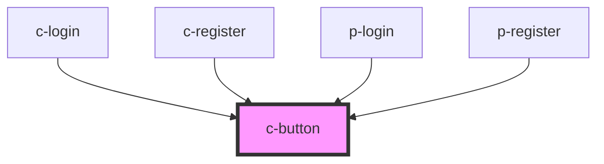

# c-button

<!-- Auto Generated Below -->

## Properties

| Property   | Attribute  | Description                                                                                            | Type                                                          | Default     |
| ---------- | ---------- | ------------------------------------------------------------------------------------------------------ | ------------------------------------------------------------- | ----------- |
| `caret`    | `caret`    | Set to true to draw the button with a caret for use with dropdowns, popovers, etc.                     | `boolean`                                                     | `false`     |
| `circle`   | `circle`   | Set to true to draw a circle button.                                                                   | `boolean`                                                     | `false`     |
| `disabled` | `disabled` | Set to true to disable the button.                                                                     | `boolean`                                                     | `false`     |
| `download` | `download` | Tells the browser to download the linked file as this filename. Only used when `href` is set.          | `string`                                                      | `undefined` |
| `height`   | `height`   | The button's height.                                                                                   | `"large" \| "medium" \| "small"`                              | `'medium'`  |
| `href`     | `href`     | When set, the underlying button will be rendered as an `<a>` with this `href` instead of a `<button>`. | `string`                                                      | `undefined` |
| `loading`  | `loading`  | Set to true to draw the button in a loading state.                                                     | `boolean`                                                     | `false`     |
| `name`     | `name`     | An optional name for the button. Ignored when `href` is set.                                           | `string`                                                      | `undefined` |
| `pill`     | `pill`     | Set to true to draw a pill-style button with rounded edges.                                            | `boolean`                                                     | `false`     |
| `target`   | `target`   | Tells the browser where to open the link. Only used when `href` is set.                                | `"_blank" \| "_parent" \| "_self" \| "_top"`                  | `undefined` |
| `type`     | `type`     | The button's type.                                                                                     | `"button" \| "reset" \| "submit"`                             | `'button'`  |
| `value`    | `value`    | An optional value for the button. Ignored when `href` is set.                                          | `string`                                                      | `undefined` |
| `variant`  | `variant`  | Button Variant                                                                                         | `"ghost" \| "icon" \| "primary" \| "secondary" \| "tertiary"` | `'primary'` |
| `width`    | `width`    | The button's width.                                                                                    | `"default" \| "fullwidth"`                                    | `'default'` |

## Events

| Event        | Description                          | Type               |
| ------------ | ------------------------------------ | ------------------ |
| `eventBlur`  | Emitted when the button loses focus. | `CustomEvent<any>` |
| `eventFocus` | Emitted when the button gains focus. | `CustomEvent<any>` |

## Methods

### `removeFocus() => Promise<void>`

Removes focus from the button.

#### Returns

Type: `Promise<void>`

### `setFocus() => Promise<void>`

Sets focus on the button.

#### Returns

Type: `Promise<void>`

## Shadow Parts

| Part       | Description |
| ---------- | ----------- |
| `"base"`   |             |
| `"caret"`  |             |
| `"label"`  |             |
| `"prefix"` |             |
| `"suffix"` |             |

## Dependencies

### Used by

 - [c-login](../c-login)
 - [c-register](../c-register)
 - [p-login](../../pages/p-login)
 - [p-register](../../pages/p-register)

### Graph

----------------------------------------------

*Built with [StencilJS](https://stenciljs.com/)*
