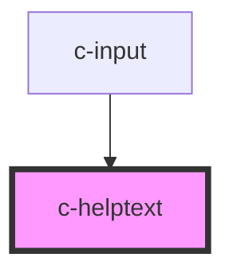

# c-helptext

<!-- Auto Generated Below -->

## Properties

| Property   | Attribute   | Description | Type            | Default     |
| ---------- | ----------- | ----------- | --------------- | ----------- |
| `hasFocus` | `has-focus` |             | `boolean`       | `false`     |
| `validity` | --          |             | `ValidityState` | `undefined` |

## Dependencies

### Used by

 - [c-input](../c-input)

### Graph

----------------------------------------------

*Built with [StencilJS](https://stenciljs.com/)*
