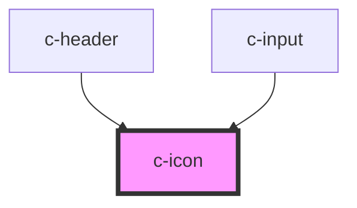

# c-icon

<!-- Auto Generated Below -->

## Properties

| Property     | Attribute     | Description                                                                                                                                                                                   | Type                 | Default     |
| ------------ | ------------- | --------------------------------------------------------------------------------------------------------------------------------------------------------------------------------------------- | -------------------- | ----------- |
| `ariaHidden` | `aria-hidden` | Set the icon to hidden, respectively `true`, to remove it from the accessibility tree.                                                                                                        | `string`             | `undefined` |
| `ariaLabel`  | `aria-label`  | Specifies the label to use for accessibility. Defaults to the icon name.                                                                                                                      | `string`             | `undefined` |
| `color`      | `color`       | The color to use for the background of the item.                                                                                                                                              | `string`             | `undefined` |
| `flipRtl`    | `flip-rtl`    | Specifies whether the icon should horizontally flip when `dir` is `"rtl"`.                                                                                                                    | `boolean`            | `undefined` |
| `icon`       | `icon`        | A combination of both `name` and `src`. If a `src` url is detected it will set the `src` property. Otherwise it assumes it's a built-in named SVG and set the `name` property.                | `"string"`           | `undefined` |
| `lazy`       | `lazy`        | If enabled, ion-icon will be loaded lazily when it's visible in the viewport. Default, `false`.                                                                                               | `boolean`            | `false`     |
| `name`       | `name`        | Specifies which icon to use from the built-in set of icons.                                                                                                                                   | `string`             | `undefined` |
| `sanitize`   | `sanitize`    | When set to `false`, SVG content that is HTTP fetched will not be checked if the response SVG content has any `<script>` elements, or any attributes that start with `on`, such as `onclick`. | `boolean`            | `true`      |
| `size`       | `size`        | The size of the icon. Available options are: `"small"` and `"large"`.                                                                                                                         | `"large" \| "small"` | `undefined` |
| `src`        | `src`         | Specifies the exact `src` of an SVG file to use.                                                                                                                                              | `string`             | `undefined` |

## Dependencies

### Used by

 - [c-header](../c-header)
 - [c-input](../c-input)

### Graph

----------------------------------------------

*Built with [StencilJS](https://stenciljs.com/)*
