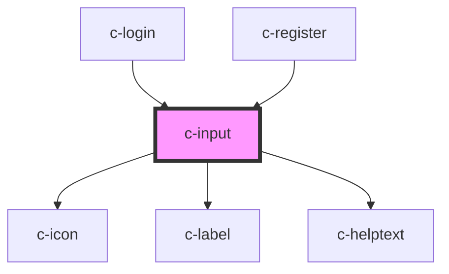

# c-input

<!-- Auto Generated Below -->

## Properties

| Property         | Attribute         | Description                                                      | Type                                                                                  | Default              |
| ---------------- | ----------------- | ---------------------------------------------------------------- | ------------------------------------------------------------------------------------- | -------------------- |
| `autocapitalize` | `autocapitalize`  | The input's autocaptialize attribute.                            | `string`                                                                              | `undefined`          |
| `autocomplete`   | `autocomplete`    | The input's autocomplete attribute.                              | `string`                                                                              | `undefined`          |
| `autocorrect`    | `autocorrect`     | The input's autocorrect attribute.                               | `string`                                                                              | `undefined`          |
| `autofocus`      | `autofocus`       | The input's autofocus attribute.                                 | `boolean`                                                                             | `undefined`          |
| `clearable`      | `clearable`       | Set to true to add a clear button when the input is populated.   | `boolean`                                                                             | `false`              |
| `disabled`       | `disabled`        | Set to true to disable the input.                                | `boolean`                                                                             | `false`              |
| `hidden`         | `hidden`          | Host display                                                     | `boolean`                                                                             | `true`               |
| `inputmode`      | `inputmode`       | The input's inputmode attribute.                                 | `"decimal" \| "email" \| "none" \| "numeric" \| "search" \| "tel" \| "text" \| "url"` | `undefined`          |
| `max`            | `max`             | The input's maximum value.                                       | `number`                                                                              | `undefined`          |
| `maxlength`      | `maxlength`       | The maximum length of input that will be considered valid.       | `number`                                                                              | `undefined`          |
| `min`            | `min`             | The input's minimum value.                                       | `number`                                                                              | `undefined`          |
| `minlength`      | `minlength`       | The minimum length of input that will be considered valid.       | `number`                                                                              | `undefined`          |
| `name`           | `name`            | The input's name attribute.                                      | `string`                                                                              | `''`                 |
| `pattern`        | `pattern`         | A pattern to validate input against.                             | `string`                                                                              | `undefined`          |
| `pill`           | `pill`            | Set to true to draw a pill-style input with rounded edges.       | `boolean`                                                                             | `false`              |
| `placeholder`    | `placeholder`     | The input's placeholder text.                                    | `string`                                                                              | `undefined`          |
| `readonly`       | `readonly`        | Set to true to make the input readonly.                          | `boolean`                                                                             | `false`              |
| `required`       | `required`        | Set to true to make the checkbox a required field.               | `boolean`                                                                             | `undefined`          |
| `size`           | `size`            | The input's size.                                                | `"large" \| "medium" \| "small"`                                                      | `'medium'`           |
| `step`           | `step`            | The input's step attribute.                                      | `number`                                                                              | `undefined`          |
| `togglePassword` | `toggle-password` | Set to true to add a password toggle button for password inputs. | `boolean`                                                                             | `false`              |
| `type`           | `type`            | The input's type.                                                | `"email" \| "number" \| "password" \| "search" \| "tel" \| "text" \| "url"`           | `'text'`             |
| `validity`       | --                | Input validity                                                   | `ValidityState`                                                                       | `InputValidityObj()` |
| `value`          | `value`           | The input's value attribute.                                     | `string`                                                                              | `''`                 |

## Events

| Event         | Description                                 | Type               |
| ------------- | ------------------------------------------- | ------------------ |
| `eventBlur`   | Emitted when the control loses focus.       | `CustomEvent<any>` |
| `eventChange` | Emitted when the control's value changes.   | `CustomEvent<any>` |
| `eventClear`  | Emitted when the clear button is activated. | `CustomEvent<any>` |
| `eventFocus`  | Emitted when the control gains focus.       | `CustomEvent<any>` |
| `eventInput`  | Emitted when the control receives input.    | `CustomEvent<any>` |

## Methods

### `removeFocus() => Promise<void>`

Removes focus from the input.

#### Returns

Type: `Promise<void>`

### `reportValidity() => Promise<ValidityState>`

Checks for validity and shows the browser's validation message if the control is invalid.

#### Returns

Type: `Promise<ValidityState>`

### `select() => Promise<void>`

Selects all the text in the input.

#### Returns

Type: `Promise<void>`

### `setCustomValidity(message: string) => Promise<void>`

Sets a custom validation message. If `message` is not empty, the field will be considered invalid.

#### Returns

Type: `Promise<void>`

### `setFocus() => Promise<void>`

Sets focus on the input.

#### Returns

Type: `Promise<void>`

### `setRangeText(replacement: string, start: number, end: number, selectMode?: 'select' | 'start' | 'end' | 'preserve') => Promise<void>`

Replaces a range of text with a new string.

#### Returns

Type: `Promise<void>`

### `setSelectionRange(selectionStart: number, selectionEnd: number, selectionDirection?: 'forward' | 'backward' | 'none') => Promise<void>`

Sets the start and end positions of the text selection (0-based).

#### Returns

Type: `Promise<void>`

## Shadow Parts

| Part                       | Description |
| -------------------------- | ----------- |
| `"field"`                  |             |
| `"input"`                  |             |
| `"password-toggle-button"` |             |

## Dependencies

### Used by

 - [c-login](../c-login)
 - [c-register](../c-register)

### Depends on

- [c-icon](../c-icon)
- [c-label](../c-label)
- [c-helptext](../c-helptext)

### Graph

----------------------------------------------

*Built with [StencilJS](https://stenciljs.com/)*
