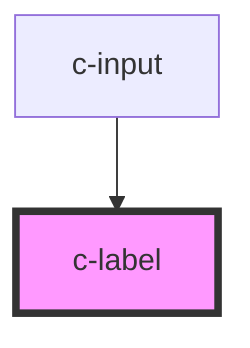

# c-label

<!-- Auto Generated Below -->

## Properties

| Property      | Attribute     | Description | Type      | Default     |
| ------------- | ------------- | ----------- | --------- | ----------- |
| `hasFocus`    | `has-focus`   |             | `boolean` | `false`     |
| `inputId`     | `input-id`    |             | `string`  | `undefined` |
| `labelId`     | `label-id`    |             | `string`  | `undefined` |
| `placeholder` | `placeholder` |             | `string`  | `undefined` |
| `relative`    | `relative`    |             | `boolean` | `false`     |
| `required`    | `required`    |             | `boolean` | `undefined` |
| `valid`       | `valid`       |             | `boolean` | `true`      |
| `value`       | `value`       |             | `string`  | `undefined` |

## Shadow Parts

| Part      | Description |
| --------- | ----------- |
| `"label"` |             |

## Dependencies

### Used by

 - [c-input](../c-input)

### Graph

----------------------------------------------

*Built with [StencilJS](https://stenciljs.com/)*
