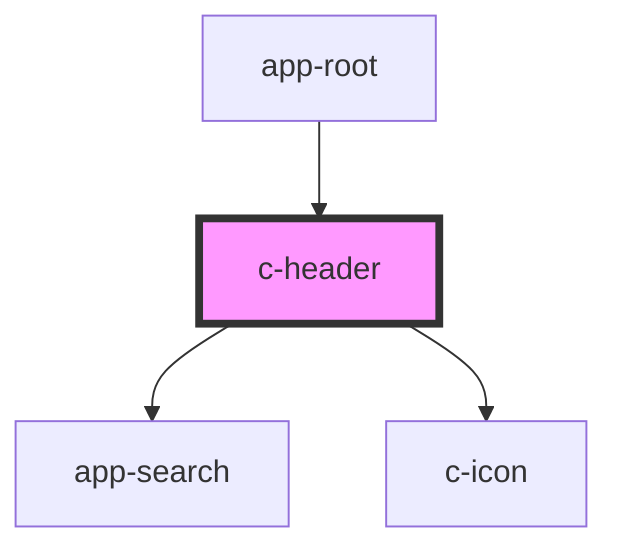

# c-header

<!-- Auto Generated Below -->

## Properties

| Property  | Attribute | Description | Type      | Default     |
| --------- | --------- | ----------- | --------- | ----------- |
| `reduced` | `reduced` |             | `boolean` | `undefined` |

## Dependencies

### Used by

 - [app-root](../app-root)

### Depends on

- [app-search](../app-search)
- [c-icon](../c-icon)

### Graph

----------------------------------------------

*Built with [StencilJS](https://stenciljs.com/)*
