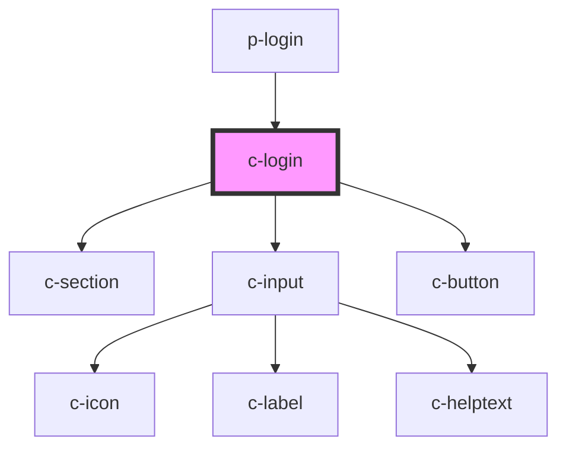

# c-login

<!-- Auto Generated Below -->

## Properties

| Property       | Attribute      | Description                                                | Type            | Default |
| -------------- | -------------- | ---------------------------------------------------------- | --------------- | ------- |
| `autocomplete` | `autocomplete` |                                                            | `"off" \| "on"` | `'off'` |
| `novalidate`   | `novalidate`   | Prevent the form from validating inputs before submitting. | `boolean`       | `false` |

## Events

| Event         | Description                                                                                                                                                                                                                                                                                                                                                                                                | Type               |
| ------------- | ---------------------------------------------------------------------------------------------------------------------------------------------------------------------------------------------------------------------------------------------------------------------------------------------------------------------------------------------------------------------------------------------------------- | ------------------ |
| `eventSubmit` | Emitted when the form is submitted. This event will not be emitted if any form control inside of it is in an invalid state, unless the form has the `novalidate` attribute. Note that there is never a need to prevent this event, since it doen't send a GET or POST request like native forms. To "prevent" submission, use a conditional around the XHR request you use to submit the form's data with. | `CustomEvent<any>` |

## Methods

### `getFormControls() => Promise<HTMLElement[]>`

Gets all form control elements (native and custom).

#### Returns

Type: `Promise<HTMLElement[]>`

### `getFormData() => Promise<FormData>`

Serializes all form controls elements and returns a `FormData` object.

#### Returns

Type: `Promise<FormData>`

### `submit() => Promise<boolean>`

Submits the form. If all controls are valid, the `slSubmit` event will be
emitted and the promise will resolve with `true`. If any form control is
invalid, the promise will resolve with `false` and no event will be
emitted.

#### Returns

Type: `Promise<boolean>`

## Shadow Parts

| Part     | Description |
| -------- | ----------- |
| `"base"` |             |

## Dependencies

### Used by

 - [p-login](../../pages/p-login)

### Depends on

- [c-section](../c-section)
- [c-input](../c-input)
- [c-button](../c-button)

### Graph

----------------------------------------------

*Built with [StencilJS](https://stenciljs.com/)*
