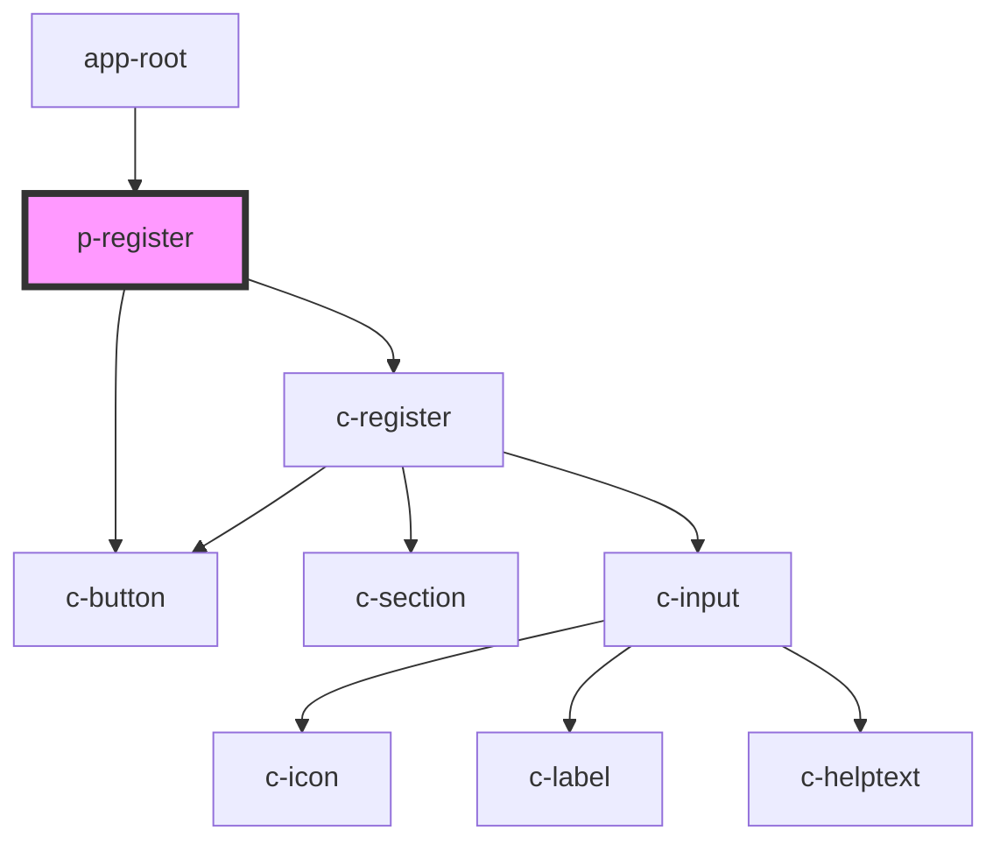

# p-register

<!-- Auto Generated Below -->

## Dependencies

### Used by

 - [app-root](../../components/app-root)

### Depends on

- [c-register](../../components/c-register)
- [c-button](../../components/c-button)

### Graph

----------------------------------------------

*Built with [StencilJS](https://stenciljs.com/)*
